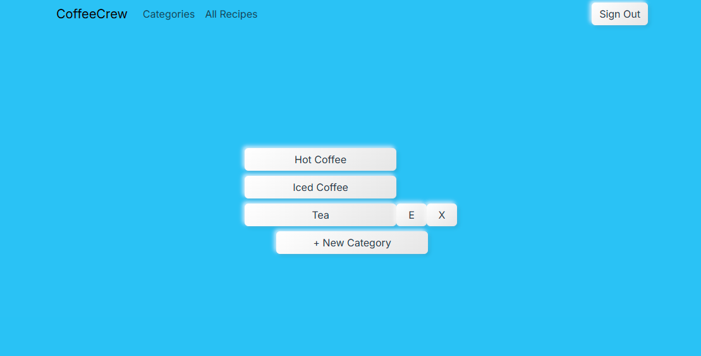

# CoffeeCrew
[Click here to access the CoffeeCrew API](https://github.com/mikemcgee92/CoffeeCrew-api)

## Overview
This is the client side application for CoffeeCrew, a barista training management app designed to aid in recipe consistency and learning.

# User story
There are two ideal user profiles for CoffeeCrew:
- Cafe owners and managers who want an easier way to ensure consistency and ease of training in recipe preparation
- Baristas and other staff who want to be able to view recipes quickly and easily to ensure quality and accuracy

## Features
- Users can add recipes to the app, edit those recipes, and delete them
- Users can add ingredients to any recipe, as well as remove ingredients
- Users can add, edit, and delete categories for organization of recipes

## Screenshots

## Links
-[Wireframe](https://www.figma.com/design/HWE0jt7RlakrEaQ9jn8ivD/Mobile-Wireframe-UI-Kit--Community-?node-id=430-5695&t=0uMbM3IIfyZA8U3Z-0)
-[ERD](https://dbdiagram.io/d/coffeeCrew-MVP-68a0afe31d75ee360adb4e73)
-[Project Board](https://github.com/users/mikemcgee92/projects/7/views/1)

## Contributors
[Mike McGee](https://github.com/mikemcgee92)
